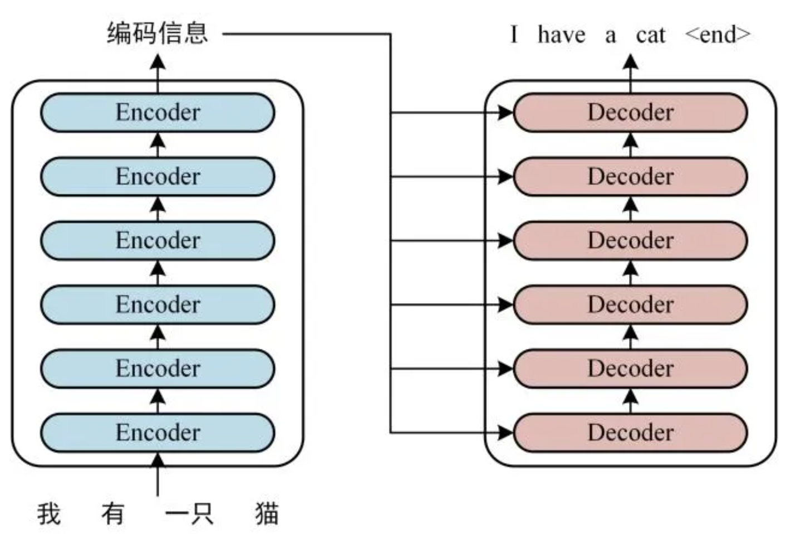
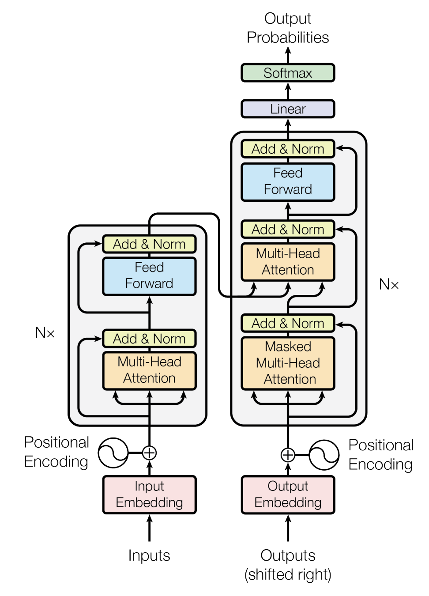
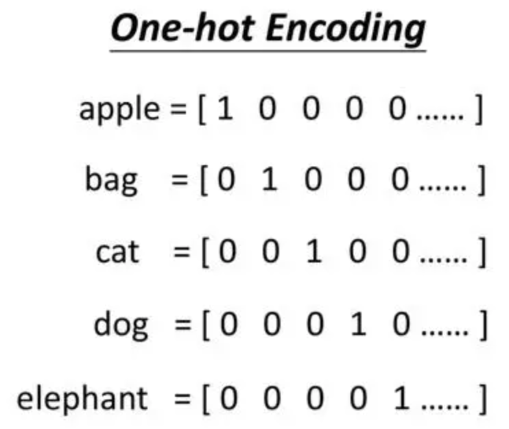
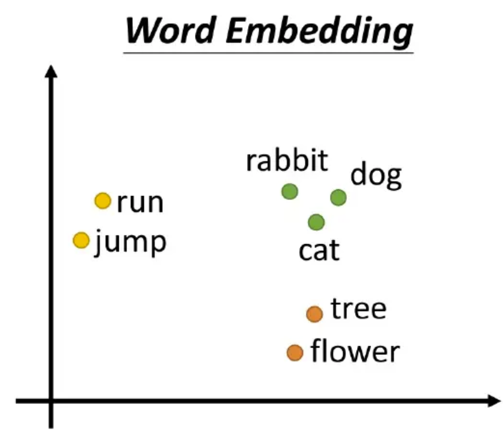
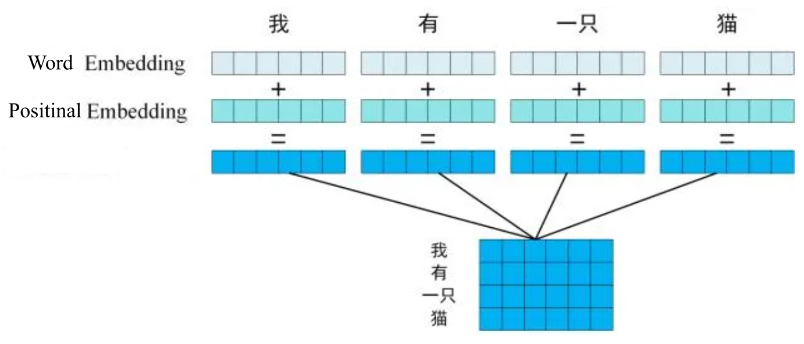
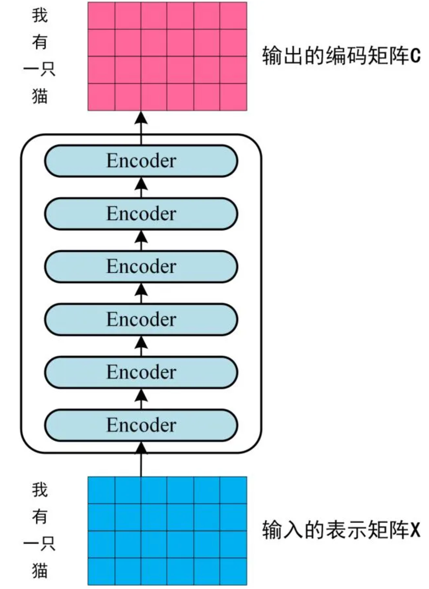
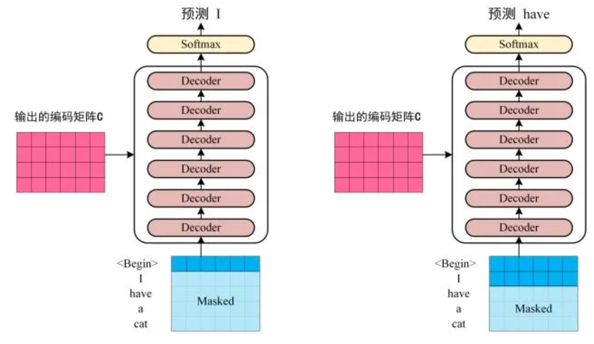
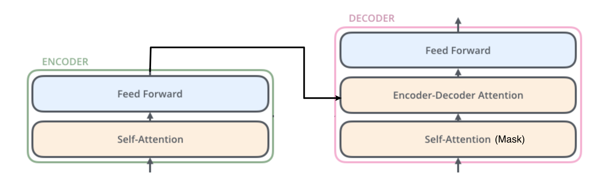

Edit by `Mar. 3, 2024`

# Transformer

## 一些小小的理论知识
> A transformer is a deep learning architecture based on the multi-head attention mechanism, proposed in a 2017 paper ["Attention Is All You Need"](https://arxiv.org/abs/1706.03762). -- Wiki

### High level review
从 high level 层面上来看，transformer其实就是一个 `black box`。而这个黑匣子由 `Encoders` 和 `Decoders` 两个部分组成。

  

`Encoders` 和 `Decoders` 其实是由多个个数相同的 encoders 和 decoders 组成的。论文里使用了6个，但这是超参，可以进行调试。

  

每一个 encoder 都有`相同的结构`，但他们`不 share weights`。Decoders 也一样。

### 过程

  

#### Input
在 transformer中，如上图所示，有两个 input part。而这两个 input part 由 **input embedding (word embedding)** 和 **positional encoding** 组成。
1. Input embedding: 比较常见的input embedding 有 One-hot encoding 和 Word embedding 两种。Input embedding 的本质是将输入输入成一组数字。
    * One-hot encoding
    * Word embedding 在嵌入空间中生成**语义上相似 和 相关单词的类似位置**。

  
  

2. Positional encoding 为`没有循环以及卷积结构`的 transformer 提供 self-attention 能够利用`位置信息`。(详见[positional_encoding.md](positional_encoding.md))

  

3. [为什么 combine 是 add 而不是 concat](why_add_not_concat.md)

#### Encoders and Decoders
1. 在 embedding 之后，数据过了 encoders 之后，会将 Encoders 输出的结果输入到每一个 Decoder 中。
2. 这里循环的部分就来了：Decoders 也有一个输入部分，而这个部分是上一次的结果。比如输入是 “我有一只猫”，那么每一次的 decoders 的输入就是 “开始符号“， ”开始符号 + I“， ”开始符号 + I + have“ + ...
3. Decoders 的输出部分还会通过一个 Linear layer 和一个 softmax layer。

  
  

其实 encoder block 和 decoder block 长得差不多。 Decoder block 比 encoder block 多的部分是一个 masked multi-head attention。

  

self-attention

***

## Coding

## Reference:
1. [Attention Is All You Need](https://arxiv.org/abs/1706.03762)
2. [The Illustrated Transformer](https://jalammar.github.io/illustrated-transformer/)
3. [Transformer模型详解（图解最完整版）](https://zhuanlan.zhihu.com/p/338817680)
4. [详解Transformer中的Positional Encoding](https://blog.csdn.net/qq_40744423/article/details/121930739#:~:text=%2Dpositional%2Dencoding%2F-,%E4%B8%80%E3%80%81%E4%B8%BA%E4%BB%80%E4%B9%88%E8%A6%81%E6%9C%89Positional%20Encoding%EF%BC%9F,Encoding%E4%BD%8D%E7%BD%AE%E7%BC%96%E7%A0%81%E2%80%9D%E7%9A%84%E6%A6%82%E5%BF%B5%E3%80%82)
5. [Transformer论文逐段精读](https://www.youtube.com/watch?v=nzqlFIcCSWQ)

