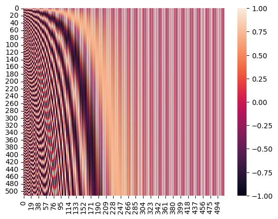

# Transformer中的Positional Encoding
这篇 Readme 在 [原文](https://blog.csdn.net/qq_40744423/article/details/121930739#:~:text=%2Dpositional%2Dencoding%2F-,%E4%B8%80%E3%80%81%E4%B8%BA%E4%BB%80%E4%B9%88%E8%A6%81%E6%9C%89Positional%20Encoding%EF%BC%9F,Encoding%E4%BD%8D%E7%BD%AE%E7%BC%96%E7%A0%81%E2%80%9D%E7%9A%84%E6%A6%82%E5%BF%B5%E3%80%82) 的基础上加入了我自己的理解。

## 为什么要有Positional Encoding？
由于Transformer中`没有循环以及卷积结构`，为了让模型能够利用`时序`，作者们插入了一些关于 tokens 在序列中相对或绝对位置的信息。因此，作者们提出了“Positional Encoding位置编码”的概念。

Positional encoding 和 words embedding 具有`同样的维度`，positional encoding 和 words embedding 可以直接相加，结果作为 Encoder 和 Decoder 的底部输入。

## 怎么定义Positional Encoding呢？
这一部分，[原文](https://blog.csdn.net/qq_40744423/article/details/121930739#:~:text=%2Dpositional%2Dencoding%2F-,%E4%B8%80%E3%80%81%E4%B8%BA%E4%BB%80%E4%B9%88%E8%A6%81%E6%9C%89Positional%20Encoding%EF%BC%9F,Encoding%E4%BD%8D%E7%BD%AE%E7%BC%96%E7%A0%81%E2%80%9D%E7%9A%84%E6%A6%82%E5%BF%B5%E3%80%82) 给出了几种可以使用的 positional encoding，并且给出了他们的优缺点，从而解释为什么论文中作者会给出三角函数型的 positional encoding 公式。

### 方式1: 表格型--直接编号
Assume 给定一个长度为 $T$ 的序列，token在序列中的位置记作 $pos$，那么 token 的位置编码
$$PE = pos = 0, 1, 2, \dots, T-1$$

> [!IMPORTANT]
> 但是这就有个问题，**如果有一段很长的序列**（假如为1000），那么**最后一个token的位置编码就是1000**，这就会产生 bias：
>
> 前后位置编码相差巨大会导致，出现特征在数值上的倾斜，从而对模型产生干扰。
>
> 那么，`这就需要位置编码最好有一定的取值范围`。

### 方式2：表格型--对每个位置 $pos$ 作归一化
$$PE = \frac{pos}{T-1}, pos \in \{0, 1, 2, \dots, T-1 \}$$

这样使得所有位置编码都落入区间 $[ 0, 1 ]$，但是问题也是显著的：

> [!IMPORTANT]
> 不同长度序列的位置编码的步长是不同的，`在较短序列中相邻的两个token的位置编码的差异，会比长序列中相邻的两个token的位置编码差异更小`。如果使用这种方法，那么在长文本中相对次序关系会被“稀释”。

> [!NOTE]
> 所以，position encoding 的定义要满足下列需求：
> 1. 每个位置有一个唯一的 positional encoding；
> 2. 最好具有一定的值域范围；
> 3. 需要体现一定的相对次序关系，并且在一定范围内的编码差异不应该依赖于文本长度，具有一定 translation invariant 平移不变性。

### 方式3: 函数型
一种思路是使用**有界的周期性函数**。
在前面的两种方法中，我们为了体现某个字在句子中的绝对位置，使用了一个单调的函数，使得任意后续的字符的位置编码都大于前面的字。
如果我们放弃对绝对位置的追求，转而要求位置编码仅仅关注一定范围内的相对次序关系，那么使用一个sin/cos函数就是很好的选择，因为sin/cos函数的周期变化规律非常稳定，所以编码具有一定的平移不变性。

$$PE(pos) = \sin(\omega \cdot pos)$$

其中，$\omega$ 越小，波长越长，即相邻的 token 的位置编码之间的差异越小。

> [!IMPORTANT]
> 但这样也存在一些问题：
> 1. 如果 $\omega$ 比较大，相邻 token 之间的位置差异不明显；
> 2. 如果 $\omega$ 比较小，在长序列中可能会有一些不同位置的token的位置编码一样，这是因为PE的值域 $[-1, 1]$ 的表现范围有限。

## 论文的选择
所以作者并没有使用单一维度的三角函数，而是将维度拓展到 512维。使用512的理由是 word embedding 的维度是 512，这样方便让 positional embedding 和 word embeeding 的结果相加。

$$PS(pos, 2i) = \sin (\frac{1}{1000^{\frac{2i}{d_{model}}}} \cdot pos)$$
$$PS(pos, 2i+1) = \cos (\frac{1}{1000^{\frac{2i}{d_{model}}}} \cdot pos)$$

where $pos$ is the position, $i$ is the dimension, and $d_{model} = 512$.

将公式给拆开，我们就会得到：
```math
PE(pos) = \left[
\begin{array}{c}
\sin(\omega_0 \cdot pos) \\
\cos(\omega_0 \cdot pos) \\
\sin(\omega_1 \cdot pos) \\
\cos(\omega_1 \cdot pos) \\
\vdots \\
\sin\left(\omega_{\frac{d_{model}}{2}-1} \cdot pos\right) \\
\cos\left(\omega_{\frac{d_{model}}{2}-1} \cdot pos\right) \\
\end{array}
\right]_{d_{model} \times 1}
= \left[
\begin{array}{c}
\sin\left(\frac{pos}{10000^{2 \times \frac{0}{512}}}\right) \\
\cos\left(\frac{pos}{10000^{2 \times \frac{0}{512}}}\right) \\
\vdots \\
\sin\left(\frac{pos}{10000^{2 \times \frac{255}{512}}}\right) \\
\cos\left(\frac{pos}{10000^{2 \times \frac{255}{512}}}\right) \\
\end{array}
\right]_{d_{model} \times 1}
\approx
\left[
\begin{array}{c}
\sin(pos) \\
\cos(pos) \\
\vdots \\
\sin(0.0010 \cdot pos) \\
\cos(0.0010 \cdot pos) \\
\end{array}
\right]_{d_{\text{model}} \times 1}
```

不过这样定义positional encoding，仍会陷入循环, 这里人为地将最大不重复序列长度限制为 512。例如，在 BERT 中就是这样做的（尽管值得一提的是他们使用了学习位置嵌入，但那是另一回事了）。 如果不这样做，模型确实无法区分序列中的第一个token和第513个token的位置编码。

## Coding
```Python
import numpy as np
import seaborn as sns

PE = np.zeros([512, 512])
d_model = 512

for pos in range(d_model):
    for i in range(int(d_model / 2)):
        PE[pos][2 * i] = np.sin(pos / (1000 ** (2 * 2 * i / d_model)))
        PE[pos][2 * i + 1] = np.cos(pos / (1000 ** (2*(2 * i + 1) / d_model)))

sns.heatmap(data=PE,vmin=-1,vmax=1)
```

<p align="center">
  
</p>

可以发现，由于sin/cos函数的性质，位置向量的每一个值都位于 $[-1, 1]$ 之间。
同时，纵向来看，图的右半边几乎都是红色的，这是因为越往后的位置，频率越小，波长越长，所以不同的t对最终的结果影响不大。
而越往左边走，颜色交替的频率越频繁。